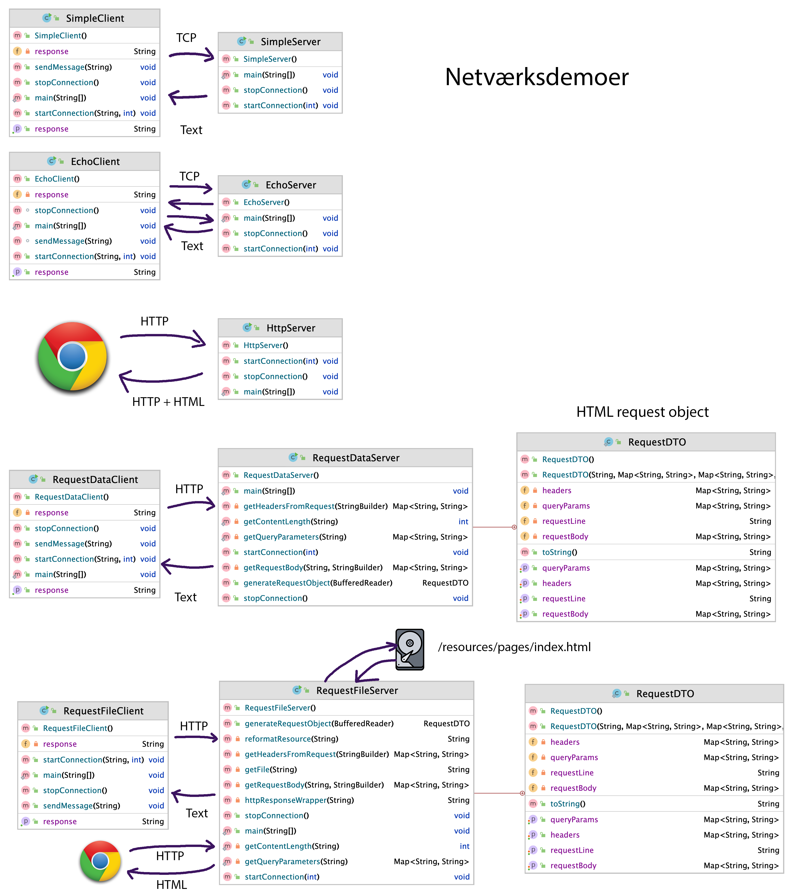

# Netværksdemoer på 2. semester

Følgende kodeeksempler skal anvendes i forbindelse med netværksugen på 2. semester.

Der er en stigende progression i eksemplerne. Her er en oversigt over de enkelte demoer
og hvad deres formål er.



De fleste eksempler kan køres på to måder:

### Gennem main

1) Start først serverens main method
2) Start dernæst klientens main metode og hold godt øje med output

### Unit-tests

1) Find den tilhørende unit-test og kør den. Bemærk at serveren startes i sin egen tråd for at det kan lade sig gøre. Mere om det i næste uge.

## Demo 01 - SimpleClient og SimpleServer

Klienten sender en enkelt tekstlinie til serveren og modtager en tekstlinie med svar. 
Ren TCP/IP udveksling. Både klient og server lukkes ned efter transaktionen.

## Demo 02 - EchoClient og EchoServer

Klienten sender tre linier tekst til serveren, som serveren sender retur (ekko'er). Bemærk at 
serveren ikke lukkes ned før den modtager beskeden "bye". Også her laves alt med ren TCP/IP.

## Demo 03 - HttpServer

Klienten sender en HTTP header afsted som flere linier tekst til serveren. Serveren kvitterer ved at 
sende et ægte HTTP response tilbage. Det gør det muligt at lave et klient request fra en browser, der viser
den stump html som sendes tilbage i responset. Bemærk at vi nu kører efter HTTP protokollen over TCP/IP. Tænk over
hvad det egentlig betyder. Vi har nu taget det første spæde spadestik mod at få lavet en webserver, der kan 
vise html-sider. Vi mangler selvfølgelig en hel de ting for at det kan fungere i praksis. Men der er hul
igennem, og vi har set hvordan man får en HTTP header igennem en socket.

## Demo 04 - RequestClient og RequestServer

I demo 03 fortolkede vi ikke indholdet af vores HTTP request. Dvs, at vi ikke læste indholdet, så vi kunne bruge det
til noget. Det gøres i denne demo. Det kaldes at **parse** indholdet af headeren og payload (body). Dvs, at vi æder os igennem
tekstfilen linie for linie og gemmer (key, value) par i diverse hashmaps. Det kræver at man nøje undersøger hvordan
den tekst man ønsker at parse er opbygget. Her er chatGPTs udlægning:

### Parsing a text

Parsing a text means analyzing its content to understand its structure and extract relevant information from it. This process involves taking the raw text and transforming it into a more structured format that a program can easily manipulate and use.

When parsing, the text is usually read sequentially, and different components are identified according to a set of predefined rules or patterns. This often involves:

1. **Tokenization**: Breaking the text into meaningful elements called tokens. For example, in the context of programming, tokens could be keywords, operators, identifiers, etc.

2. **Syntax Analysis**: Checking that the sequence of tokens follows the allowed structure of the language or format. This may involve looking at the grammar rules of the language.

3. **Semantic Analysis**: Understanding what the tokens mean in their particular context (for instance, recognizing that a certain string of characters represents a specific command or a data type).

In the context of an HTTP header, parsing would involve taking the raw text of the header and extracting key pieces of information from it. An HTTP header is structured as a series of key-value pairs, each on a new line, and each pair is separated by a colon. Here's an example of what an HTTP header might look like:

```
Content-Type: text/html
Cache-Control: no-cache
Connection: keep-alive
```

When parsing this, a parser would:

1. Identify each line as a separate field.
2. Within each line, separate the key (e.g., "Content-Type") and the value (e.g., "text/html") based on the colon that separates them.
3. Store these in a structured format, like a dictionary or a map, so that the program can easily look up the value for a given key.

After parsing, the program can easily understand and manipulate the data, such as determining the content type of a response, managing caching policies, or handling the connection type.

I demo 04 sender klienten et http request afsted med header og request parametre - 
og så returnerer serveren den parsede udgave retur. Vi bruger det ikke rigtig til noget, men det er et stykke
forarbejde vi skal høste resultatet af senere.

## Demo 05 - RequestDataClient og RequestDataServer

I de første demoer har vi kun sendt tekst retur fra serveren. I demo 05 tager vi et skridt videre i retning af
en ægte webserver. En webserver returnerer ressourcer. Eller med andet ord:
**filer**. Typisk HTML filer, CSS filer, script-filer, billede-filer med mere. I request-headeren angives hvilken
ressource man ønsker fra serveren. F.eks. `/index.html`. Hvis du ser godt efter i demo 05, så ligger
disse ressource-filer i folderen `resources`. Det kræver lidt ekstra armbøjninger at kunne indlæse filer
på en server. Man kender jo ikke folderstrukturen, så derfor håndteres det på en speciel måde i forhold til
det I har set på 1. semester. Se metoden `getFile` for nærmere detaljer. Du behøver ikke at forstå det i detaljer.
Det kræver i øvrigt mindst Java 11 for at kunne læse filer på den måde.

Når filen er indlæst skal indholdet sendes tilbage til klienten (en browser). Det kræver at vi sætter en
HTTP response-header på. Ellers kan browseren ikke forstå formatet. Vi har med vilje ikke lavet demo 05 helt færdig.
Der er udkommenteret den del som sætter HTTP response headeren på. Det har vi gjort for lettere at kunne
unit-teste koden.


